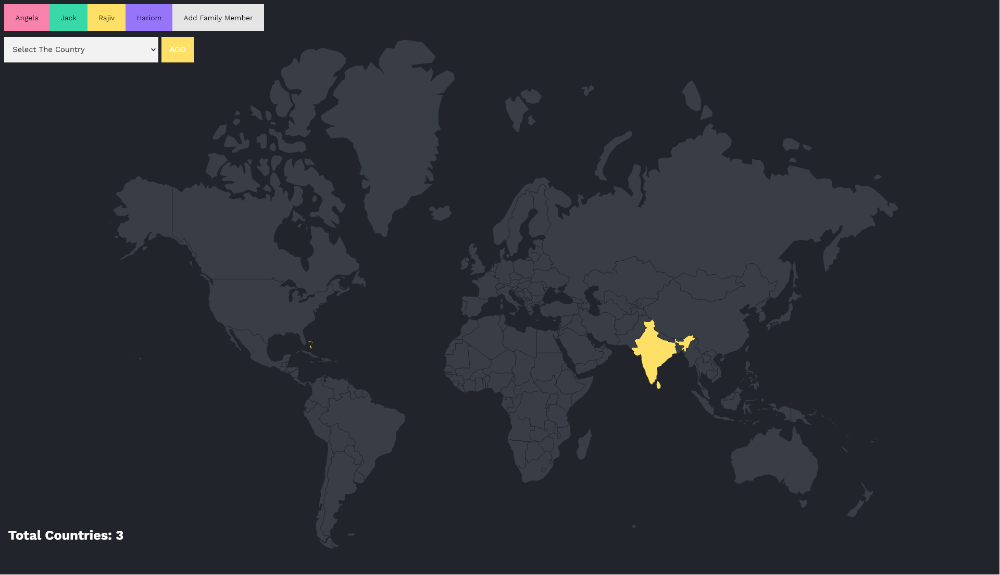

# Family Travel Tracker

## Table of Contents
- [Family Travel Tracker](#family-travel-tracker)
  - [Table of Contents](#table-of-contents)
  - [Project Overview](#project-overview)
  - [Features](#features)
  - [Technologies Used](#technologies-used)
  - [Installation](#installation)
  - [Usage](#usage)
  - [Configuration](#configuration)
  - [Database Setup](#database-setup)
  - [Screenshots](#screenshots)
  - [Contact](#contact)

## Project Overview

The Family Travel Tracker is a web application that allows users to keep track of countries they have visited. It uses Node.js, Express, EJS, and PostgreSQL to provide a simple and interactive way to visualize travel history.

## Features

*   **Interactive Map:** Highlights visited countries on a world map.
*   **Country Selection:** Provides a dropdown list of countries to mark as visited.
*   **Real-time Updates:** Updates the map and statistics as countries are added.

## Technologies Used

*   Node.js
*   Express
*   EJS
*   PostgreSQL
*   CSS
*   HTML
*   JavaScript

## Installation

1.  **Clone the repository:**

    ```sh
    git clone <repository_url>
    ```
2. **Navigate to the project directory:**
    ```sh
    cd <project_directory>
    ```
2.  **Install dependencies:**

    ```sh
    npm install
    ```

## Usage

1.  **Configuration:**

    Create a `.env` file in the root directory with the following variables:

    ```env
    DB_USER=your_db_user
    DB_HOST=localhost
    DB_DATABASE=world
    DB_PASSWORD=your_db_password
    DB_PORT=5432
    ```

    Replace the values with your PostgreSQL database credentials.
2.  **Database Setup:**

    *   Ensure PostgreSQL is installed and running.
    *   Create a database with the name specified in the `.env` file (e.g., `world`).
    *   Run the SQL queries from `queries.sql` to create the necessary tables (`users` and `visited_countries`) and the `countries_` table.
3.  **Start the server:**

    ```sh
    npm start
    ```

    Open your browser and navigate to `http://localhost:3000`.

## Configuration

The application uses environment variables for database configuration. Ensure that the `.env` file is correctly set up with your PostgreSQL credentials.

## Database Setup

1.  **Create the `users` table:**

    ```sql
    CREATE TABLE users (
        id SERIAL PRIMARY KEY,
        name VARCHAR(50) NOT NULL,
        color char(7) NOT NULL
    );
    ```
2.  **Create the `visited_countries` table:**

    ```sql
    CREATE TABLE visited_countries (
      id SERIAL PRIMARY KEY,
      country_code char(2),
      user_id INTEGER,
      UNIQUE(country_code, user_id)
    );
    ```
3.  **Create the `countries_` table:**
    ```sql
    CREATE TABLE countries_ (
        id SERIAL PRIMARY KEY,
        country_name VARCHAR(50) NOT NULL,
        country_code CHAR(2) NOT NULL
    );
    ```
4.  **Add data to the `countries_` table:**

    Use the `countries.csv` file to populate the `countries_` table. Run the following command in your PostgreSQL environment:

    ```sql
    \COPY countries_(country_name, country_code) FROM 'path/to/countries.csv' DELIMITER ',' CSV HEADER;
    ```

    Replace `path/to/countries.csv` with the actual path to the `countries.csv` file on your system.

## Screenshots

Here are some screenshots of the application:

1. **Homepage:**
   

2. **Interactive Map:**
   

3. **Country Selection:**
   

## Contact

*   **Rajiv Kumar**
*   **Email:** kumarrajiv0920@gmail.com
*   **GitHub:** [My GitHub Profile](https://github.com/Rajiv-0920)
*   **Linkedin:** [Connect with me on LinkedIn](https://www.linkedin.com/in/rajiv4373)